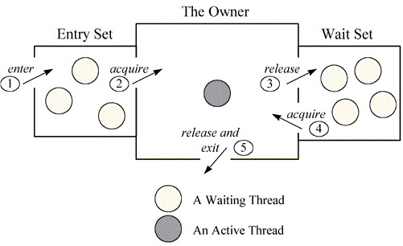
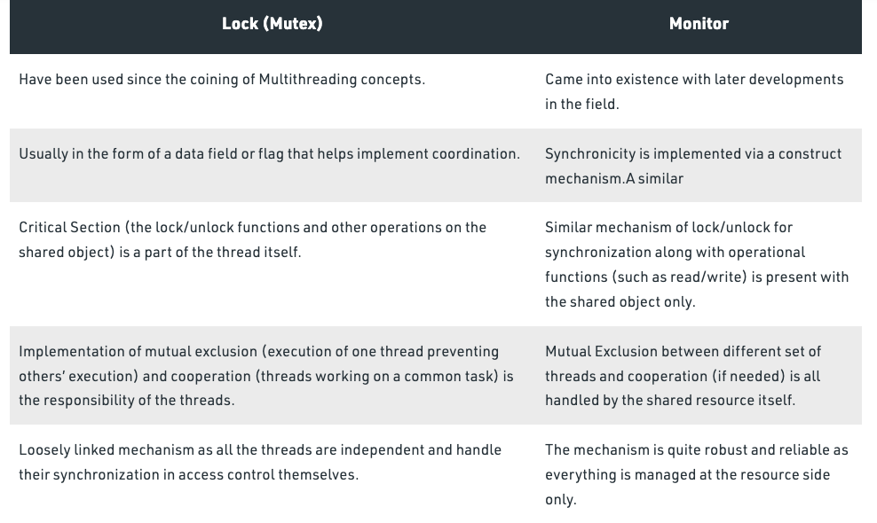

# 10주차 과제: 멀티쓰레드 프로그래밍

# 목표

자바의 멀티쓰레드 프로그래밍에 대해 학습하세요.

## Thread란?

프로세스 내에서 실제로 작업을 수행하는 주체
---

## Thread 클래스와 Runnable 인터페이스

자바에서 스레드를 구현할 때 기본적으로 Thread 클래스와 Runnable 인터페이스를 사용한다.

```java
public class ThreadTest {

    @Test
    public void testThread() {
        Thread a = new Thread() {
            @Override
            public void run() {
                System.out.println("a");
            }
        };
        a.start();

        System.out.println("Hello");
    }

    @Test
    public void runnableTest() {
        Thread a = new Thread(() -> {
            System.out.println("a");
        });

        a.start();
        System.out.println("Hello");
    }
}
```

Runnable 은 함수형 인터페이스이기 때문에 람다식을 이용해 스레드를 편하게 생성이 가능하다.

```java

@FunctionalInterface
public interface Runnable {
    public abstract void run();
}

```

---

## 쓰레드의 상태


### NEW : 아직 시작되지 않은 새로 생성된 상태

```java
public class TheradStateTest {
    @Test
    public void newStateTest() {
        Thread thread = new Thread();
        System.out.println(thread.getState()); // NEW
    }
}
```

### RUNNALBE : 실행 중이거나 실행할 준비가 돼있지만 리소스 할당을 기다리는 상태

```java
public class ThreadStateTest {

    @Test
    public void runnableTest() {
        Thread t = new Thread(() -> {
            System.out.println("started.");
        });
        t.start();
        System.out.println(t.getState()); // RUNNABLE
    }
}
```

멀티스레드 환경에서 Thread-Scheduler(JVM의 일부)는 한 스레드가 고정된 특정 시간동안만 실행되도록 합니다. 그리고 시간이 지나면 다른 RUNNABLE 상태의 스레드에게 실행 권한을 넘겨줍니다. (
시분할 시스템)

### BLOCKED : 모니터 락을 얻기 위해(synchronized 블록이나 메서드에 진입하기 위해) 기다리는 상태

```java
public class ThreadStateTest {

    @Test
    public void blockedTest() throws InterruptedException {
        Thread a = new Thread(ThreadStateTest::resource);
        Thread b = new Thread(ThreadStateTest::resource);

        a.start();
        Thread.sleep(1000);
        b.start();

        System.out.println("a is " + a.getState());
        System.out.println("b is " + b.getState()); // BLOCKED
        System.exit(0);
    }

    public static synchronized void resource() {
        while (true) {
        }
    }
}

```

### WAITING : 시간 제한없이 다른 스레드가 특정 행동을 하기를 기다리는 상태

javadoc에 의하면 이 상태는 3개의 메서드로 만들어질 수 있습니다.

- Object.wait()
- Thread.join()
- LockSupport.park()

wait의 경우, 다른 스레드가 notify() 나 notifyAll()을 호출할 때까지 기다립니다.  
join의 경우, 해당 스레드가 종료될때까지 기다립니다.

```java
public class WaitStateTest {

    @Test
    public void waitTest() throws InterruptedException {
        Thread t1 = new Thread(() -> {
            try {
                staticResource("대기");
            } catch (InterruptedException e) {
                System.out.println(e.getMessage());
//                throw new RuntimeException(e);
            }
        });

        t1.start();

        Thread.sleep(1000);
        System.out.println(t1.getState());
    }

    public synchronized void staticResource(String action) throws InterruptedException {
        if (action.equals("대기")) wait();
    }

}
```

### TIMED_WAITING : 시간 제한을 두고 다른 스레드가 특정 행동을 하기를 기다리는 상태

javadoc에 의하면 이 상태는 아래의 메서드들로 만들어질 수 있습니다.

- thread.sleep(long millis)
- wait(int timeout) or wait(int timeout, int nanos)
- thread.join(long millis)
- LockSupport.parkNanos
- LockSupport.parkUntil

### TERMINATED : 실행이 끝난 상태

### 모니터란?


---
동시성을 제어하는 어떤 패턴에 가까운 용어인듯 하다.


출처 : https://www.geeksforgeeks.org/difference-between-lock-and-monitor-in-java-concurrency/
락과 모니터는 다르다.

가장 두드러지는 차이점은 상호배제가 락에서는 스레드 각각의 책임인 반면,
모니터에서는 공유 자원에 있다는 점이다.

## 쓰레드의 우선순위

Thread.setPriority(int) 를 이용해 쓰레드 우선순위를 정할 수 있다.
값이 높을수록 우선순위가 높이지고, 스레드 스케줄링에서 실행될 빈도가 높아진다.

---

## Main 쓰레드

프로그램을 시작하기 위한 태초의 스레드.  
메인 스레드 안에 여러 자식 스레드가 생겨날 수 있다.
---

## 동기화

명시적으로 동기화 시켜주기 위해 synchronized 키워드를 사용.

### synchronized 메서드

!주의할 점
synchronized 메서드 자체에 모니터 락이 걸리는게 아니라, 메서드가 속한 객체에 락이 걸린다.

```java

public class SynchronizedTest {

    @Test
    public void test() throws InterruptedException {
        SyncMock m = new SyncMock();

        Thread t1 = new Thread(() -> {
            m.method("대기");
        });

        t1.start();

        Thread.sleep(1000);
        m.hello(); // 무한 대기
    }
}

class SyncMock {
    public String message = "hello";

    public synchronized void method(String action) {
        if (action.equals("대기")) {
            while (true) {
            }
        }
    }

    public synchronized void hello() {
        System.out.println("Hello");
    }
}
```

### synchronized 블록

synchronized 블록을 사용하면 모니터 락 대상을 지정할 수 있습니다.

```text
synchronized (모니터 락 대상 객체) {
    // 동기화 코드
}
```

---

## 데드락

### 발생 조건

- 상호 배제 : 자원은 한 번에 한 프로세스만 사용 가능
- 점유 대기 : 최소한 하나의 자원을 점유하고 있으면서 다른 프로세스에 할당되어 사용하고 있는 자원을 사용 대기하는 프로세스가 있어야 한다.
- 비선점 : 다른 프로세스에 할당된 자원을 강제로 뺏을 수 없다.
- 순환 대기 : 자원 할당 그래프가 순환하는 경우이다.

### 예방법

1) 상호 배제 (Mutual exclusion) 부정

- 여러 개의 프로세스가 공유 자원을 사용할 수 있도록 한다.

2) 점유 대기 (Hold and wait) 부정

- 필요한 자원을 부분 할당하지 않고, 프로세스가 실행되기 전 필요한 모든 자원을 할당한다.

3) 비선점 (No preemption) 부정

- 자원을 점유하고 있는 프로세스가 다른 자원을 요구할 때 점유하고 있는 자원을 반납하거나, 무한정 사용되지 않도록 타임아웃을 건다.

4) 순환 대기 (Circular wait) 부정

- 자원에 고유한 번호를 할당하고, 번호 순서대로 자원을 요구하도록 한다.