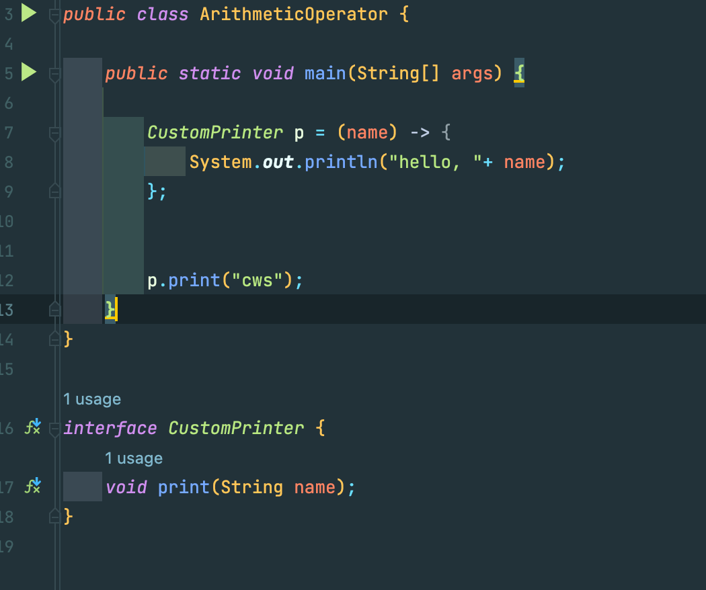

# Java Study 3주차

## 목표 
자바가 제공하는 다양한 연산자를 학습하세요.

## 항목

### 산술 연산자

- \+ : 덧셈 
- \- : 뺄셈
- \* : 곱셈
- \/ : 나눗셈(몫)
- \% : 나눗셈(나머지)

* 숫자 타입이 다른 경우, 형변환이 일어난 경우 계산이 일어난다.  
정수형끼리  => 범위가 큰 타입으로 형변환 후 계산.  
정수형과 실수형의 혼재 => 실수형으로 타입 변환 후 계산  
실수형끼리 => double로 형변환 후 계산.  

#### 음수인 정수의 비트 표현
- 부호 비트와 2의 보수 이용
- \+ => 부호 비트 0, \- => 부호 비트 1

#### 2의 보수란?
2진수를 비트 부호를 반전시키고 1을 더하면 구할 수 있다.

#### 왜 2의 보수를 구하는데?

출처 : https://thrillfighter.tistory.com/349

컴퓨터는 덧셈, 뺄셈 연산도 모두 더하기로 처리.  
-127에 해당하는 음수는 127의 비트와 더해서 모두 0000 0000이 되는 비트여야 한다.
그 관계를 2의 보수를 이용해 찾음.  

#### 실수의 비트 구조, 부동 소수점
출처 : https://thrillfighter.tistory.com/349

  
### 비트 연산자

#### 비트 이동 연산자
- x << y : 정수 x의 각 비트를 y만큼 왼쪽으로 이동시킨다. (빈자리는 0으로 채워진다.)  
- x >> y : 정수 x의 각 비트는 y만큼 오른쪽으로 이동시킨다. (빈자리는 정수 a의 최상위 부호 비트와 같은 값으로 채워진다.)  
- x >>> y : 정수 x의 각 비트를 y만큼 오른쪽으로 이동시킨다.  

#### 비트 논리 연산자

- \& : 두 비트 모두 1일 경우에만 결과가 1
- \| : 두 비트 중 적어도 하나가 1일 경우에 결과가 1
- \^ : 두 비트 중 하나는 1이고 하나는 0일떄만 결과가 1
- \~ : 비트 반전

### 관계 연산자

- \> : 왼쪽 항이 크면 참을, 아니면 거짓을 반환  
- \< : 왼쪽 항이 작으면 참, 아니면 거짓을 반환  
- \>= : 왼쪽 항이 오른쪽 항보다 크거나 같으면 참, 아니면 거짓을 반환  
- \<= : 오른쪽 항이 왼쪽 항보다 크거나 같으면 참, 아니면 거짓을 반환  
- \== : 두 개 항의 값이 같으면 참, 아니면 거짓을 반환  
- \!= : 두 개 항이 다르면 참, 아니면 거짓 반환

### 논리 연산자
- \&& : 두 항이 모두 참인 경우 결과 값이 참. 그렇지 않으면 거짓  
- \|| : 두 항 중 하나라도 참이면 결과 값이 참. 두 항 모두 거짓일 경우 거짓  
- \! : 단항 연산자. 참 => 거짓, 거짓 => 참  

### instance of
- 인스턴스가 어떤 타입인지 판별할 때 사용.  
자신의 타입뿐만 아니라 상위 타입에 대해서도 true를 반환

### assignment(=) 연산자
#### 일반 더하기 연산의 경우

1. 2을 읽는다.
2. 2를 메모리에 저장한다.
3. 2를 메모리에서 로드한다.
4. 3을 읽는다.
5. 2와 3을 더한다
6. 5를 저장한다
7. 리턴

#### 복합 연산자의 경우

1. 1을 읽는다
2. 1을 저장한다
3. 1,2를 더하고 저장하는 연산 실행
4. 리턴

딱히 성능상의 이점이 있는거 같진 않다.  
아 ~ 이렇구나 정도의 참고

### 화살표(->) 연산자
람디식을 표현하기 위한 연산자.  
람다식은 프로그래밍 언어에서 익명 함수를 지칭하는 용어이다.  

인터페이스의 추상 메서드가 하나인 경우, 아래와 같이 람다식으로 표현하는 것이 가능하다.  

### 3항 연산자
변수 = 조건문 ? 참인 경우 반환값 : 거짓인 경우 반환값  

간단한 if else 문을 간단하게 표현 가능하다.

### 연산자 우선 순위

출처 : https://kephilab.tistory.com/28

#### 대략 정리
- 단항, 이항, 삼항 연산자 순으로 우선 순위를 가짐.
- 산술, 비교, 논리, 대입 연산자 순으로 우선 순위를 가짐.
- 단항과 대입 연산자를 제외한 모든 연산 방향은 왼쪽에서 오른쪽으로
- 복잡한 연산식에는 ()를 사용해서 우선 순위 지정 하자

연산자 우선 순위를 심각하게 따져야 할만한 코드는 뭔가 잘못된게 아닐까?
### Java 13, switch 연산자
- switch문 자체가 값을 리턴하는 표현식으로 바뀜.
- break 대신 yield로 리턴
- : 대신 -> 와 중괄호로 표현 가능