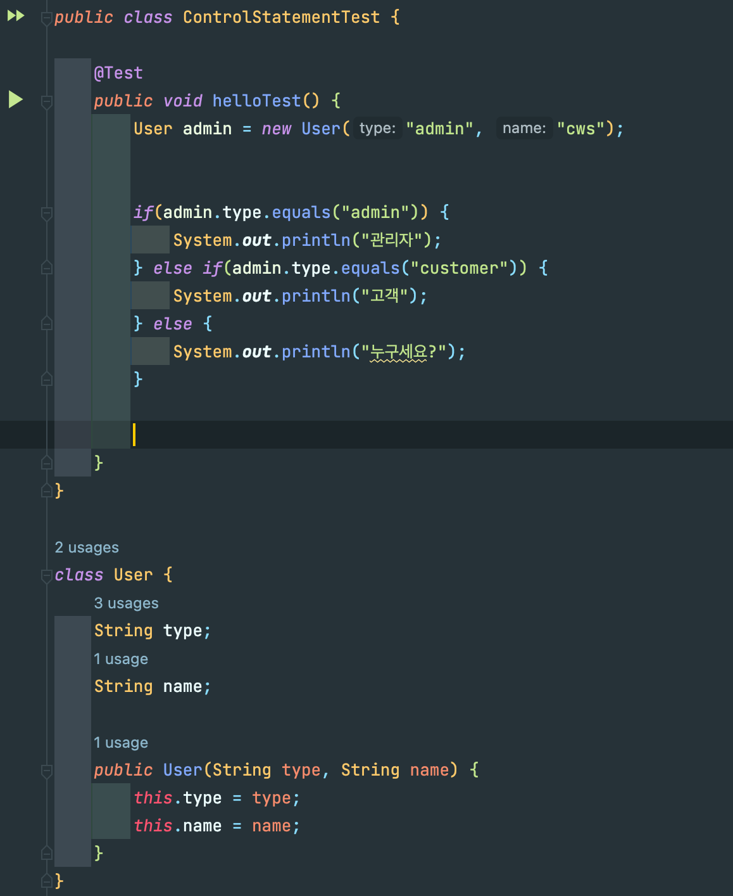
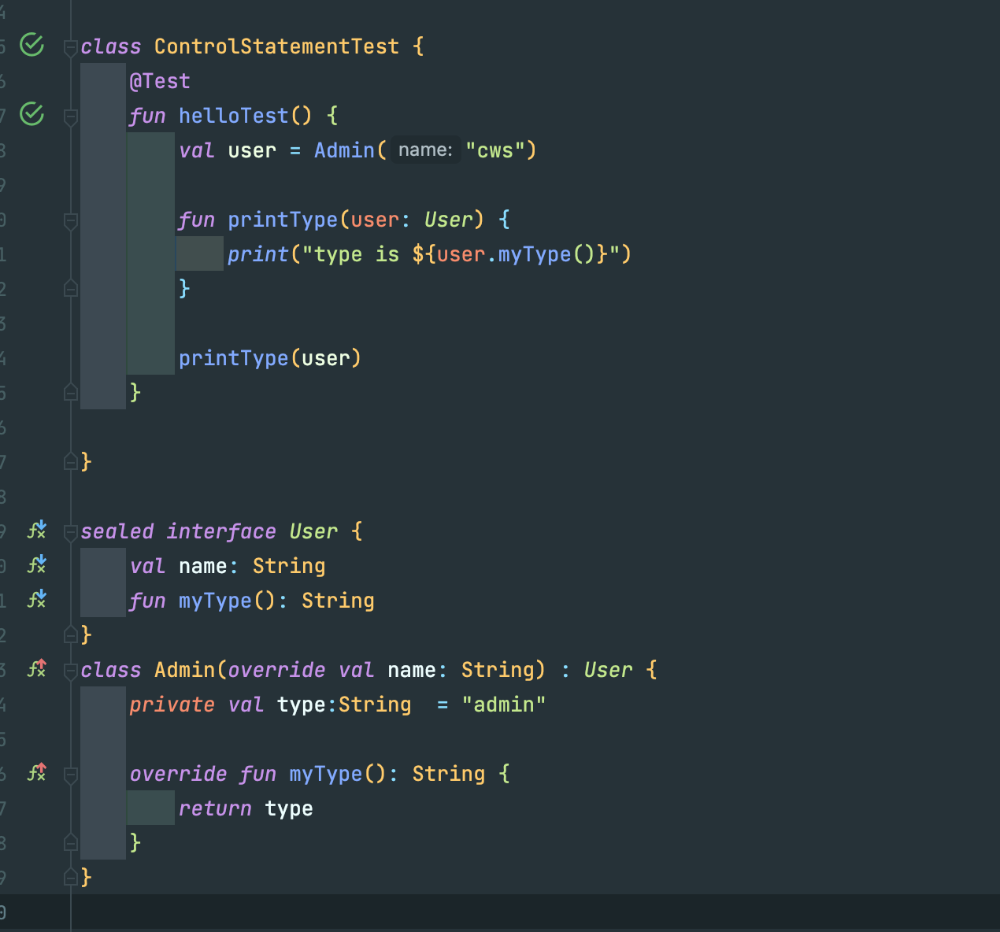
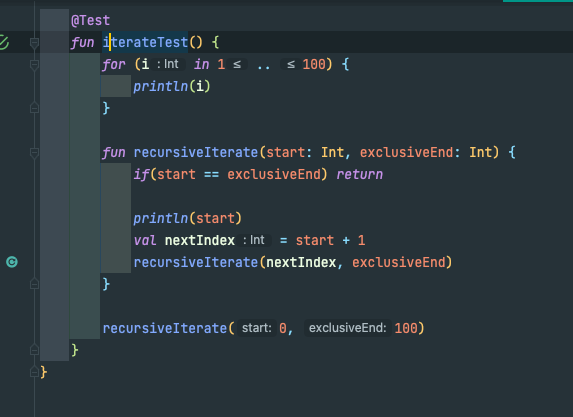

# 4주차 과제: 제어문

## 목표

자바가 제공하는 제어문을 학습하세요.

## 선택문

### 클린코드 측면에서 바라본 if문

주의: 작성자의 주관적인 의견이 많이 들어간 부분입니다.

복잡한 로직의 코드를 작성하다보면 if분기 코드는 dirty code가 되게 쉬운 부분입니다.

if문을 사용하는 개발자 입장에서 if문의 용도는 크게 두가지로 나뉘는 것 같습니다.

1. 상태값의 검증  
   대부분이 간단한 if로 구성됨. null 체크나 유효성 검증을 하는 경우입니다.
2. 상태에 따라 다른 로직을 처리해야하는 경우  
   이 경우는 if else, else 문이 여러개 추가되는 경우입니다.  
   예를 들어 사용자의 role에 따라 로직이 달라지는 경우, role을 이용해 else if 문등이 추가되는 경우입니다.

두번째의 경우, 코드가 쉽게 난잡해질 수 있습니다.

2번의 경우는 코드 구조를 변경하면 조금 더 나은 코드를 작성할 수 있습니다.

### 객체가 행동하게 하자



위의 코드에서는 User의 상태가 추가될 때마다 if문에 분기 처리 로직이 계속 추가되게 됩니다.  
user 인스턴스를 호출하는 상위 컨텍스트에 user의 타입 명시하는 방식으로 코드를 작성했기 때문입니다.

위 코드는 아래처럼 객체지향으로 풀어낼 수 있습니다.



User 인터페이스를 구현하는 Admin, Customer 인스턴스에 행동을 위임함으로서 분기하는 로직이 사라졌습니다.

## 반복문

### 모든 for 반복문은 재귀 호출로도 표현이 가능하다.



### 왜 재귀호출을 사용하는가?

재귀호출 로직은 for문으로도 변환이 가능합니다.  
그렇다면 재귀호출을 왜 사용할까요?  
대표적인 예로 파일 탐색기를 예로 들 수 있습니다. 전체 디렉토리를 검색해 파일을 찾아내는 기능을 구현한다고 해봅시다.
파일 완전 탐색을 for문으로 구현하려면 디렉토리의 최대 깊이 레벨만큼 for문을 중첩해야합니다. 디렉토리가 a/b/c/d/e로 구성돼있다면 5중첩 for문을 작성해야합니다.

재귀호출은 깊이 우선 탐색 방식으로 동작하기 때문에 평면적인 탐색이 아닌 계층(깊이) 탐색의 경우 유용하게 사용할 수 있습니다.

아래와 같은 분야에선 재귀호출은 필수로 알아야 합니다.

- 그래프, 트리, 최단 거리 ... 알고리즘 분야
- 계층 구조의 표현

### 파일탐색 예제 코드

```kotlin
fun searchFile(node: Node, fileName: String): File? {
    return when (node) {
        is File -> if (node.fileName == fileName) node else null
        is Directory -> {
            for (child in node.childrenNodes) {
                val ret = searchFile(child, fileName)
                if (ret != null) return ret
            }
            null
        }
    }
}

sealed interface Node
class Directory(
    val childrenNodes: List<Node>,
    val path: String
) : Node
class File(
    val path: String,
    val fileName: String
) : Node

```


