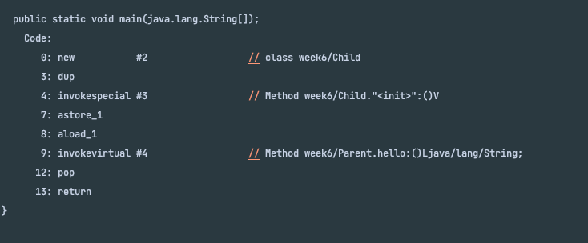

# 5주차 과제: 클래스

## 목표

자바의 상속에 대해 학습하세요.

## 자바 상속의 특징

클래스 간 부모-자식 계층 관계를 형성하는데 사용한다.  
자식 클래스는 부모 클래스의 멤버 필드, 메서드를 사용할 수 있고, 메서드의 경우 재정의할 수 있다.

- 다중 상속이 되지 않는다.
- 상속 횟수에 제한 없음
- 자바의 최상위 클래스는 Object

## super 키워드

### 생성자: super()

자식 클래스에서 부모 생성자를 호출하기 위해서 사용.


new Child()로 객체를 생성해보면 "parent" 라는 문자열이 찍히는걸 확인 가능.

호출하지 않더라도 자바 내부에서 기본적으로 super()를 호출한다.

### 부모 객체 참조: super

자식 클래스가 생성될 때, super()를 이용해 부모클래스도 같이 생성됐었다.
super를 이용해 생성된 부모 객체에 접근이 가능하다.

## 메소드 오버라이딩

### 상속관계에서는 선택적인 요소

오버라이딩할 경우, 자식 클래스에서 오버라이딩 된 메서드 호출
오버라이딩 하지 않는 경우, 부모 클래스의 메서드 호출

### 인터페이스, 추상클래스

인터페이스와 추상클래스에 정의된 추상메서드는 자식 클래스에서 반드시 오버라이딩 돼야한다.

오버라이딩시 규칙

1. 메서드 시그니처가 동일(접근 제한자 제외)
2. 접근 제한자 범위를 더 좁힐 수 없다. 넓히는 건 가능
3. 새로운 예외를 던질 수 없다

## 다이나믹 메소드 디스패처

런타임 시점에 어떤 메서드를 실행할지 결정하는 과정을 말한다.

```java
public class JavaInterfaceExample {

    public static void main(String[] args) {
        Parent p = new Child();
        p.hello();
    }

}


class Parent {
    public String hello() {
        return "parent";
    }
}

class Child extends Parent {

    @Override
    public String hello() {
        return "child";
    }
}
```

아래는 main() 메서드의 바이트코드


main 메서드를 실행하면 오버라이드된 메서드가 실행됨에도 불구하고,
바이트코드에는 Parent.hello가 찍히는걸 볼 수 있다.  
위 바이트코드에서 보이는 것처럼 컴파일 시점에 오버라이드된 메서드가 어떤 자식타입에 의해 실행되는지 모른다.

정확히 어떤 과정인지는 모르겠으나, 자바 내부에서 런타임에 타입정보를 가지고 어떤 메서드를 실행할지 결정하고 있다.

## 추상 클래스

자바 기존 클래스와 비슷하지만, 추상 메서드를 선언할 수 있다는 점이 다르다.

```java
abstract class B {
    public abstract String hello();
}
```

추상 메서드는 위 코드와 같이 접근 제한자 뒤에 abstract 라는 키워드를 넣어서 메서드 본문없이 생성 가능하다.

### 용도

추상 클래스는 템플릿 메서드 패턴에 자주 사용된다.  
추상 메서드를 이용해 구현부는 자식에게 맡기고, 추상 클래스 내에서는 이 추상 메서드를 이용해 로직 템플릿을 만드는 용도로 자주 사용.

```java
abstract class B {
    public abstract String hello();

    public void printHello() {
        System.out.println(hello());
    }
}
```

하지만 자바8 이후에 인터페이스에도 default 메서드를 생성할 수 있게 됐는데, 굳이 추상 클래스를 사용할 필요가 있을까 싶다.

```java
interface A {

    String hello();

    default void printHello() {
        System.out.println(hello());
    }

}
```

## final 키워드

### 클래스 레벨에 사용될 경우

해당 클래스는 상속이 제한된다.

### 메서드 레벨에서 사용될 경우

오버라이딩이 제한된다.

### 변수 레벨에서 사용될 경우

변수를 선언하는 시점에 값이 할당돼야하며, 이후에 이 값을 바꿀 수 없다.

## Object 클래스

자바에서 모든 객체들이 상속하는 super 클래스.

### equals, hashCode

hashCode() 해쉬 자료구조에서 사용된다.  
예로, HashMap은 키 값의 해쉬코드 이용해 밸류를 저장하는 맵 구조다.

equals 는 객체간 동등성 조건을 나타내기 위한 메서드.  
객체 비교를 위해 넓게 사용된다.
예)

```
String a = "a";
String b = "a";

a.equals(b) // true
```

해쉬 자료구조에서도 객체 동등성이 유지될 수 있도록 해줘야 된다.

