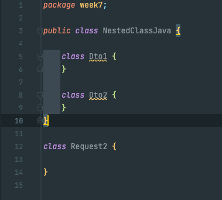
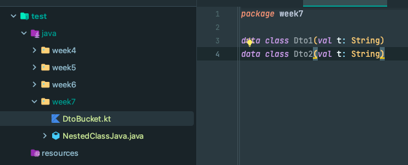
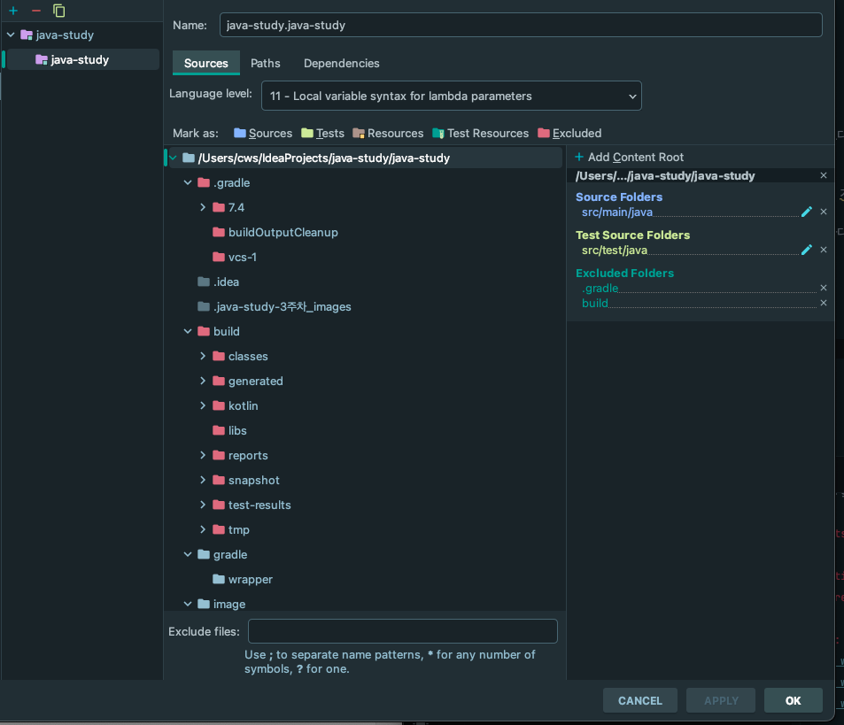

# 7주차 과제: 패키지

## 목표

자바의 패키지에 대해 학습하세요.

### package 키워드

자바의 클래스를 분류하기 위한 네임스페이스.

```java
package example.hello;

class Hello {
    // 클래스 내용
}
```

package 뒤에 .으로 연결되는 경로가 온다.

#### 참고) 하나의 파일에 여러 클래스를 작성하는 경우

가끔씩 하나의 엔티티에 대한 Dto 관련 클래스를 모아놓고 싶은 경우가 있다.  
자바에서는 보통 하나의 패키지 경로에 여러 클래스를 담아 해결한다.  
하나의 파일에 담아내기엔 불편한 점이 있기 때문.



불편한 제약이 있다.

* 같은 파일 내에 public class는 하나 뿐이어야 한다.
  그냥 public이 붙지 않은 클래스는 기본적으로 default 접근 제한자가 붙기 때문에, 다른 패지키에서 import 할 수 없다.
* public class 내의 중첩 클래스로 작성가능하지만 NestedClassJava.Dto1로 계속 생성하기가 귀찮다.


코틀린은 위 코드처럼 간단하게 한 파일에 여러 관련 클래스를 모듈화할 수 있다.  
코틀린 컴파일러는 Dto1, Dto2를 모두 public class로 컴파일하기 때문.

코틀린에서 data class를 사용하면 아주 간단하게 DTO 클래스를 생성할 수 있기 때문에  
위와 같은 방식으로 필자는 관련 DTO들을 한 파일에 그룹화해서 사용하고 있다.

### import 키워드

외부의 클래스 파일을 정보를 가져오기 위한 keyword

### 클래스패스

JVM이 프로그램을 실행할 때, 클래스파일을 찾는데 기준이 되는 파일 경로

### 클래스패스를 설정하는 방법

### 1. -classpath 옵션

```text
javac -classpath <파일 경로>
```

javac 명령어로 컴파일시 클래스패스를 지정해 줄 수 있다.

```text
javac -classpath <파일 경로1>;<파일 경로1>;
```

경로가 다수라면 세미콜론으로 구분해 다수의 경로를 추가해줄 수 있다.

### 2. CLASSPATH 환경변수

운영체제에서 사용하는 환경변수를 직접 등록해서 클래스패스 지정이 가능하다.  
이 방식은 특정 운영체제에 설정이 종속돼버려서 이식성이 좋지 못하다.

3. IDE를 이용해서 지정
   인텔리제이를 이용하면 편리하게 클래스패스 지정이 가능하다.



디렉토리를 클릭하고 위에 Sources, Tests 등 메뉴를 통해 각 카테고리별 클래스패스를 지정할 수 있다.

### 접근지시자

#### Java

* public : 어디에서나 접근 가능함
* private : 해당 클래스 내에서만 접근 가능함
* protected : 해당 클래스 및 자식 클래스에서만 접근이 가능함.
* default : 동일 패지니 내에 있는 클래스라면 접근이 가능하다.

#### 코틀린

*자바와의 차이점*

- 자바에서는 기본 접근지시자가 default지만 코틀린에서는 public이다. default는 없어짐
- internal 지시자가 추가됨.
  internal : 같은 모듈 내에서는 어디서든 접근 가능

  같은 모듈의 정의
- IntelliJ IDEA 모듈
- 메이븐 프로젝트
- 그레이들 source set
- kotlinc를 호출했을 때, 같이 컴파일되는 파일 set
