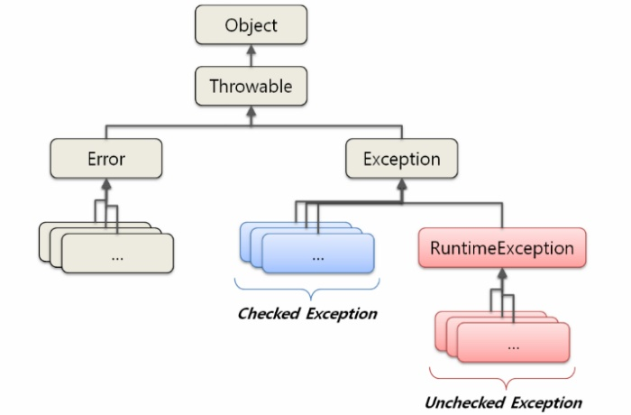

# 9주차 과제: 예외 처리

## 목표

자바의 예외 처리에 대해 학습하세요.

## 자바에서 예외 처리 방법 (try, catch, throw, throws, finally)

### try catch 구문

```text
    public void test() {
        try {
            throwException();
        } catch (Exception e) {
            e.printStackTrace();
        }
    }k
```

예외 처리가 필요한 코드를 try 블록으로 감싸고 catch 블록에서 예외를 처리합니다.  
catch 문에는 처리할 예외를 명시할 수 있습니다. 필요하다면 여러 개의 catch 문을 명시할 수 있습니다.

#### 여러 개의 catch문을 사용하는 경우

```text
    public void test() {
        try {
            throwException();
        } catch (IOException | RuntimeException e) {
            e.printStackTrace();
        } catch (Exception e) {
            throw new RuntimeException(e);
        }
    }
```

위 코드와 같이 여러 개의 catch문을 작성할 수 있습니다.  
이 경우, catch 문의 순서가 의미를 갖습니다.  
try 블록에서 던져진 예외는 가장 위쪽에 선언된 catch 블록을 따라가면서 명시된 예외와 비교하면서 차례대로 매칭됩니다.
예외 매칭시 catch 괄호 안에 해당 예외 타입의 부모 타입이 와도 매칭이 가능합니다.  
그렇기 때문에 catch할 예외가 계층적이라면 가장 구체적인 예외를 가장 먼저 catch 문에 등록하는게 좋습니다.

그리고 java 7부터 catch 문 안에 여러 예외 타입을 '|'를 이용해 등록할 수 있습니다.  
'|'를 이용할 경우, 등록되는 예외들은 부모 자식 관계가 아니어야 합니다. (아니면 컴파일 오류 발생)

### throw, throws

```text
    public void throwException() throws Exception {
        throw new Exception();
    }
```

throw 키워드 뒤에 예외 클래스를 생성하면 예외를 발생시킬 수 있습니다.  
예외를 발생시킬 경우, 메서드 시그니쳐에 throws 키워드를 이용해 발생시킨 예외를 명시해줘야합니다.

### finally

```text
    public void test() {
        try {
            throwException();
        } catch (Exception e) {
            throw new RuntimeException(e);
        } finally {
            System.out.println("finally");
        }
    }
```

finally 블록의 코드는 예외 발생 여부와 상관없이 실행됩니다.

### 참고) 코틀린에서의 예외

- 코틀린에서는 checked exception이 없습니다.
- 자바에서 try catch 문은 값을 반환하지 않지만, 코틀린에서는 Nothing이라는 타입을 반환하는 표현식입니다.

## 자바가 제공하는 예외 계층 구조


출처 : https://itmining.tistory.com/9


출처 : https://rollbar.com/wp-content/uploads/2021/07/java-exceptions-hierarchy-example.png

## Exception과 Error의 차이는?

### Exception

애플리케이션 레벨에서 처리해야할 예외 조건들을 처리하는데 사용.

### Error

시스템 레벨에서 더 심각한 문제를 나타낼 때 사용.

```text
    public void hello() {
        hello();
    }
```

위 코드는 StackOverflowError 를 발생시킵니다.  
jvm stack 메모리에 올릴 수 있는 메소드 스택을 초과했다는 뜻으로, 이는 애플리케이션 레벨에서 복구가 불가능한 에러입니다.

반면에 예외는 이보다 덜 심각한 애플리케이션에서 나타나는 말그래도 '예외'를 처리하기 위한 것으로,   
예외를 잡아서 다른 로직을 타게 한다거나, 다시 시도하는 식의 흐름을 조절할 수 있습니다.

## RuntimeException과 RE가 아닌 것의 차이는?

### RuntimeException vs CheckedException

유일한 차이점은 명시적으로 예외처리를 해야하느냐 마느냐입니다.  
checked의 경우 명시적으로 예외 처리를 해야하지만, runtime의 경우 하지 않아도 됩니다.

## checked exception을 기피하는 추세

1. 에러를 던질 경우 메서드 시그니처에 에러 타입이 드러난다
   만약 UserRepository 라는 인터페이스에 몇가지 추상 메서드를 만들었다고 하자.

```java
interface UserRepository {
    User getUser(Long id) throws IOException;
}
```

getUser 메서드는 CE인 IOException 라는 에러 타입을 시그니처에 명시했다.  
만약 나중에 getUser가 다른 CE를 던질 수 있다는 사실을 알게 됐다면 인터페이스의 시그니처를 바꿔야 할 수도 있다.  
그럴경우 하위 구현체들도 수정이 필요하다.

2. 마땅한 처리 대안이 없는 경우도 있다.
   만약 DB에서 오류가 발생해 IOException이 발생했다고 하자.  
   catch 블록에서 간단한 메세지를 찍는거 외에 애플리케이션 코드로 딱히 뭘 할 수 있는게 없다.

3. stream, 람다를 사용할 경우 가독성이 떨어지는 부분

## 커스텀한 예외 만드는 방법

```java
class CustomException extends RuntimeException {

    public CustomException(String message) {
        super(message);
    }
}
```

Exception 타입을 상속해 커스텀 예외를 만들 수 있습니다.  
